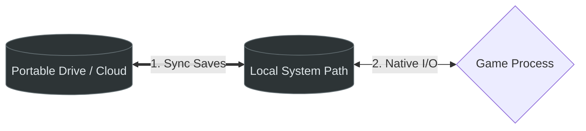
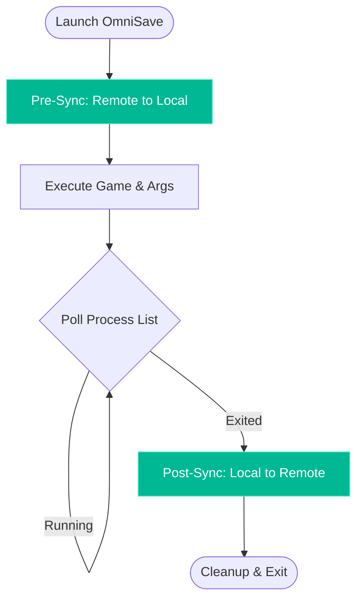

# OmniSave

OmniSave v0.2.0 is a lightweight, portable game save synchronization tool for Windows, specifically designed to run reliably under **Wine**, **CrossOver**, and **GameHub** (Winlator/Box64) environments.

It acts as a "Launch Wrapper" that automates the process of fetching your saves from a portable location (like a USB drive or a cloud-synced folder), launching the game, and then backing up your progress immediately after you finish playing.

## How It Works

OmniSave "fakes" a local installation by redirecting your save files. It ensures that the game always finds your saves in the expected system directory (like `Documents` or `AppData`), even when your actual data lives on a portable drive.

### 1. Storage Architecture
The wrapper bridges the gap between your portable storage and the system's local save directory.



### 2. Execution Lifecycle
OmniSave manages the entire gaming session from start to finish.



## Inspiration & Goals

Inspired by the **PortableApps** philosophy, OmniSave fixes the issue of modern games having "hard-coded" save paths. By using a Sync-Launch-Sync cycle, it allows you to carry your entire gaming session on a single folder/drive across different machines without manual file management.

## Verified Compatibility

OmniSave has been tested and verified across various hardware and software environments:
- **Windows 10 Gaming PC**: Native performance and file system handling.
- **MacBook Neo (macOS)**: Running via **CrossOver** and **Wine** translation layers.
- **Samsung S25 Ultra**: Running through **GameHub** (Winlator/Box64) mobile environments.

## Key Features

- **Sync-Launch-Sync Architecture**: Ensures your local environment is up-to-date before playing and your remote backup is updated after.
- **Process Polling**: Unlike standard wrappers that wait for a process handle, OmniSave polls the system memory. This allows it to stay alive even if the game launcher (like Rockstar Launcher) detaches or spawns background child processes.
- **Launch Arguments Support**: Pass arbitrary boot flags (like `-nobattleye` or `-windowed`) directly to the game.
- **Path Resolution**: Supports `~/` expansion for user profile directories and `./` for relative portable paths.
- **Mutex Locking**: Prevents multiple instances from running simultaneously to avoid save corruption.

## Configuration (`omnisave.ini`)

Place `omnisave.ini` in the same directory as `OmniSave.exe`.

```ini
[OmniSave]
; The executable name to launch and monitor
Launch_Command=GTA5.exe

; Optional command line arguments
Launch_Args=-nobattleye

; The local path where the game expects saves (supports ~/)
Local_Path=~/Documents/Rockstar Games/GTA V

; The remote path for backups (supports ./)
Remote_Path=./portable_saves/GTA_V
```

## Roadmap

- **Safety Enhancements**: Implementing atomic file writes and integrity checks during sync to prevent data loss on sudden power-off.
- Linux/Steam Deck Support: Native Linux builds with automated Proton Prefix detection. Since each game on Linux/Proton lives in its own isolated folder (compatdata), OmniSave will automate the path discovery for these environments.

## Testing

OmniSave uses the [Unity](https://github.com/ThrowTheSwitch/Unity) test framework and a platform abstraction layer to allow unit testing on non-Windows systems.

### Running Tests Locally

To run the unit tests on macOS or Linux:

```bash
make test
```

This will:
1. Clone the Unity framework into `vendor/`.
2. Compile the core logic with a mock platform layer.
3. Run the test suite and report results.

### CI/CD

All pushes and pull requests are automatically tested via GitHub Actions on Ubuntu, verifying both the unit tests and the MinGW cross-compilation for Windows.

## Build Instructions

Built using MinGW-w64 for cross-platform compatibility.

```bash
make clean && make
```

## Changelog

### v0.2.0
- **Safety Fix**: Replaced `strncpy` with `snprintf` in path expansion to ensure proper null-termination.
- **Robustness Fix**: Increased internal command-line buffer to 4096 characters to prevent truncation during launch.
- **New Feature**: Atomic file writes via temporary `.omnitmp` files.
- **New Feature**: Deletion propagation support (Local -> Remote) during post-sync.
- **Testing**: Added buffer safety and null-termination unit tests.

### v0.1.0
- Initial release with Sync-Launch-Sync architecture.
- Process polling support for launcher compatibility.
- Unit testing framework integration.

## License
MIT
